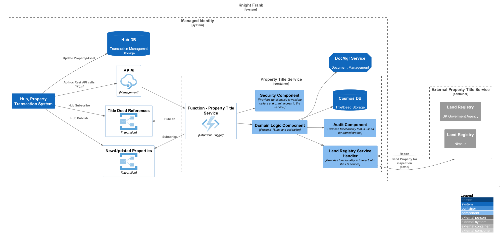
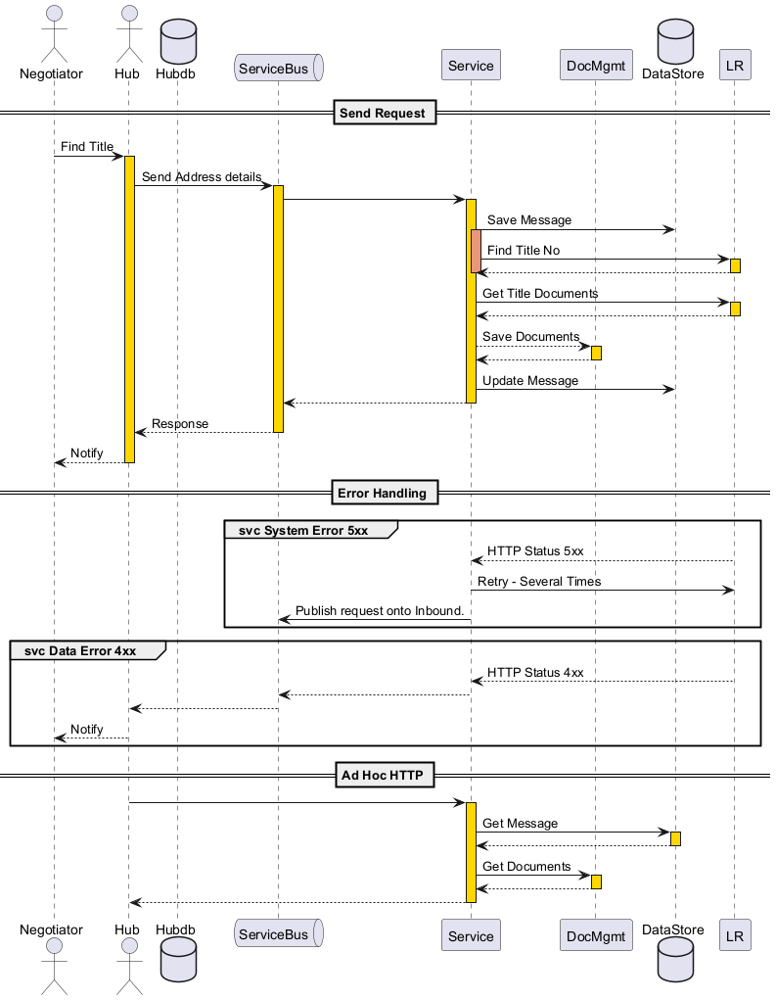
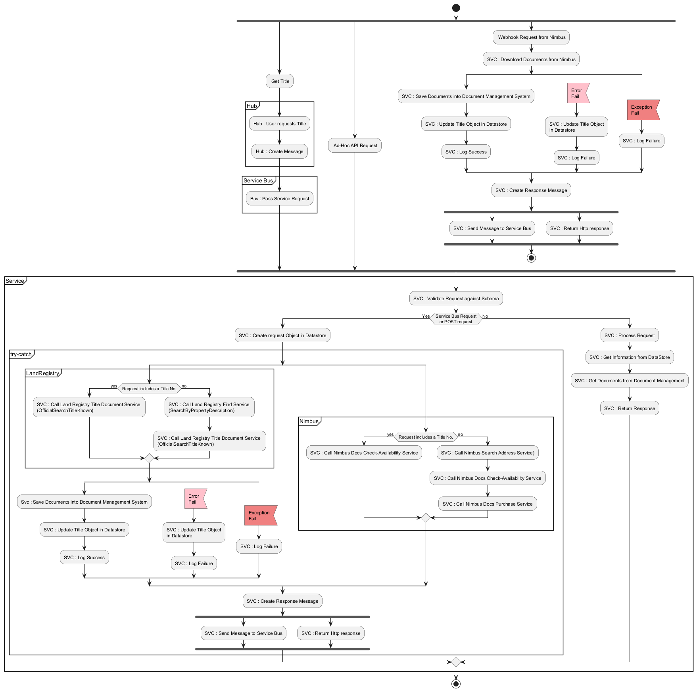

# 5, Building Block View

This service will receive instructions via the service bus, and ad-hoc queries via a HTTP interface.
This service has been designed to manage the interface to the third party.
Marshal responses and provide a asynchronous update back to the calling system.

### Contained Building Blocks

| **Name**                 | **Responsibility**                                                                       |
| ------------------------ | ---------------------------------------------------------------------------------------- |
| Hub                      | Rules and requirements to instigate LR operations
| Azure Function           | Is the interface to all systems. provides both Restful API and Service Bus Interfaces.   |
| Security Component       | Provides all Managed Identity and User Identity/Access controls                          |
| Audit Component          | Provides a standardised set of audit data retrieval methods, and SOC Alert rules         |
| Cosmos Db Component      | Provides any abstractions or specialisations necessary to access Knight Franks Cosmos DB |
| Service Handler          | Is a specific interface for the UK Govt. Land Registry service.                          |
| Domain Logic Component   | Provides rules and workflow to satisfy the requirements of this service                  |

### Hub
Hub is our internal system that currently manages Tenancies. 
Rules need to be applied to tenancies so that the LR workflow is triggered. These rules will need to be applied when a User interacts.

### Azure Function

The Azure function is the external interface for the service and will support both a RESTful API and a service bus interfaces.

The Service Bus interface is the main interface for creating property inspections.

The RESTful API will follow standard REST naming conventions e.g. /Customers or /Customer/{id} to return a collection or a single entity. The RESTful API also employ OPENAPI documentation frames detailing the request and response models, and all return statuses.

## Components

The component libraries should be general and built so they can be copied or included in other projects.

### Security Component

This component will validate the Managed Identity Header. This indicates that the calling application has been authorised to use this service. If a caller fails the Managed Identity authorisation then the method should return a HTTP Status of 401 Unauthorised. If a user token is included, then it should be validated with Entra Id(Active Directory) and the returned claims inspected. Failure should result in a HTTP Status 403 Forbidden.

### Audit Component

Generally all audit components will implement the same API calls, this will allow an admin application to produced consistent reporting across the service estate. The Audit component can supply additional API methods to return specific information that only applies to the current service. The audit interface should be included with the service API, and include calls to return counts based on usage by user/system.

### Cosmos Db Component

This component should utilise the CQRS pattern, All read requests should be serviced by Azure Search queries. Cosmos Db should be implemented with the NoSQL container. This component should use both the Microsoft.Azure.Cosmos and Azure.Identity libraries. The calling client application will be authorised by Managed Identity to access the Cosmos DB. This component should encapsulate any Knight Frank nuances which are general to our usage of Cosmos DB, such as naming conventions or setting configuration.

### Service Handler

This service handler will interact with the Land Registry Service. All data will be passed to/from this service in a canonical form, so internal systems are not dependant on changes to the LR service.

### Domain Logic Component

The domain logic component implements the business requirements of the service. It consists of a workflow and rules. Workflow will not contain rules. The workflow will only ever ask questions of the rules.

### Sequence of Interactions

The sequence diagram below shows the flow of calls to the filter service.

### Flowchart

### Component Detail

1. Hub Detail
2. Azure Function Detail
3. Security Component
4. Service Component
5. Domain Logic Component
6. Cosmos DB Component
